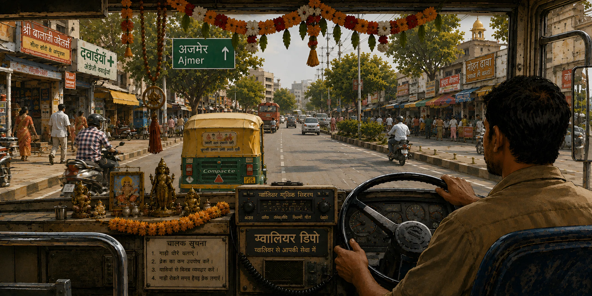

# सवारी रेडियो — Sawaari Radio

Non-stop highway radio from the front seat of an Indian public bus.

**Live:** [bus-radio.vercel.app](https://bus-radio.vercel.app)

A single full-bleed illustrated scene — the view past the driver, through the windshield, onto a roadside town — fills the screen. A floating glass player sits over it, playing a shuffled, curated playlist of Hindi film music. Autoplay is off; the first note only plays after an actual click.



## Features

- Full-bleed illustrated hero scene, with its own dedicated crop and layout for mobile — not just a squeezed-down desktop view
- Custom player: play/pause, skip, drag-to-scrub progress bar (mouse + touch), keyboard seek (arrows, Home/End)
- 61-song curated playlist, shuffled fresh on every load
- Screen-reader support on the seek bar (`aria-valuetext` reports real times, not a bare percentage)
- Graceful handling when playback is blocked by an ad/privacy blocker (e.g. Brave Shields blocks YouTube's player API by default for some users) — explains what's happening instead of failing silently
- No accounts, no tracking, no analytics

## Stack

Vanilla HTML/CSS/JS, no build step, no framework, no bundler.

- **Audio:** [YouTube IFrame Player API](https://developers.google.com/youtube/iframe_api_reference), hidden player + custom controls, served from the privacy-enhanced `youtube-nocookie.com` domain. No self-hosted media files — see [Licensing](#licensing) below.
- **Motion:** [GSAP](https://gsap.com/) (CDN) for small UI micro-interactions only — the background illustration itself never animates.
- **Fonts:** [Anek Devanagari](https://fonts.google.com/specimen/Anek+Devanagari) (display/masthead) + [DM Mono](https://fonts.google.com/specimen/DM+Mono) (status bar, timestamps), both via Google Fonts.
- **Hosting:** [Vercel](https://vercel.com), deployed straight from this repo — no CI build step.

## Project structure

```
index.html
css/style.css
js/app.js              — player state, controls, shuffle, progress/seek
assets/hero.webp        — background illustration
assets/playlist.json    — {title, channel, videoId}[]
design_handoff_glass_shelf_player/  — desktop design reference (1280×720)
design_handoff_glass_shelf_mobile/  — mobile design reference (390×844)
```

## Running locally

No build step — just serve the folder statically and open it, since `fetch()`-ing `assets/playlist.json` needs an actual `http://` origin (won't work opened directly as a `file://` URL):

```bash
python3 -m http.server 4173
```

Then open `http://localhost:4173`.

## Licensing

Audio is embedded exclusively via hidden YouTube players — never self-hosted MP3s or video files. Every video ID in `assets/playlist.json` is sourced from a manually curated, human-confirmed YouTube playlist; none are auto-generated or guessed. This keeps the site on the right side of the line: embedding official YouTube uploads is standard practice, whereas re-hosting the audio itself would not be.

## Known limitation

Some ad/privacy blockers — notably Brave's Shields, even in Private windows — block YouTube's player API outright by default for some users. There's no client-side workaround for this (the API has no alternate domain to fall back to); the site detects it and explains what's happening rather than leaving a dead play button.

---

Built by [@kanishksingh3012](https://github.com/kanishksingh3012)
